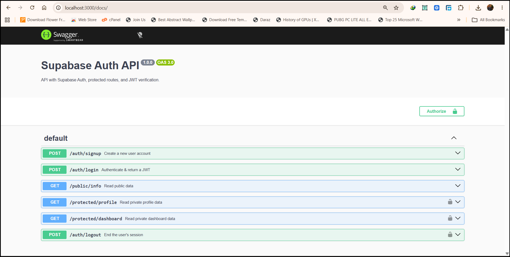

# Secure API with Supabase Auth

This project is a secure backend API built with Express.js that handles user authentication (Sign Up, Log In, Log Out) and protects specific routes using Supabase as the Identity Provider.

## Setup Instructions

1. Clone this repository.
2. Run `npm install` to install dependencies.
3. Create a `.env` file based on `.env.example` and add your Supabase project URL and anon key.

## Run the Server

Start the server using the following command:
```bash
node index.js
```

## API Endpoints
| Route | Purpose | Auth Required |
| --- | --- | --- |
| `POST /auth/signup` | Create a new user account | No |
| `POST /auth/login` | Authenticate & return a JWT | No |
| `GET /public/info` | Read public, open data | No |
| `GET /protected/profile` | Read private profile data | Yes (Bearer Token) |
| `GET /protected/dashboard` | Read private dashboard data | Yes (Bearer Token) |
| `POST /auth/logout` | End the user's session | Yes (Bearer Token) |

## Swagger UI Documentation

